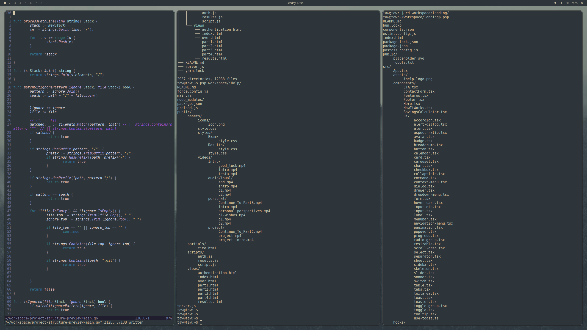

# Project Structure Preview 🗂️

**Project Structure Preview** is a simple and lightweight CLI tool written in Go that displays the directory structure of any project in a clean, tree-like format — similar to the output of the Unix `tree` command, but fast, minimal, and dependency-free, and compatable with the git projects.

I love using LLM tools to help me write the README.md files, but they often struggle to generate accurate project structure diagrams. This tool aims to fill that gap by providing a quick and easy way to visualize your project's file hierarchy.

---

## 🚀 Features

- 📁 Recursively lists files and directories  
- 🧩 Displays nested folder hierarchies with indentation  
- ⚡ Fast and lightweight (pure Go, no external dependencies)  
- 🛠️ Works across platforms (Linux, macOS, Windows)  
- 🧹 Ideal for project documentation or quick overviews  

---

## Preview 



---

## 📦 Installation

You can install it directly from source:

```bash
git clone https://github.com/tawfiqkhalilieh/ProjectStructurePreview.git
cd ProjectStructurePreview
go build -o psp main.go {path} # path is optional 
```

## 💡 Usage

```
./psp . # Replace '.' with your target directory path
```

you can also move it to your `/usr/local/bin` or any directory in your PATH to use it globally:

```bash
mv psp /usr/local/bin/
```

and use it like this:

```bash
psp /path/to/your/project
```
